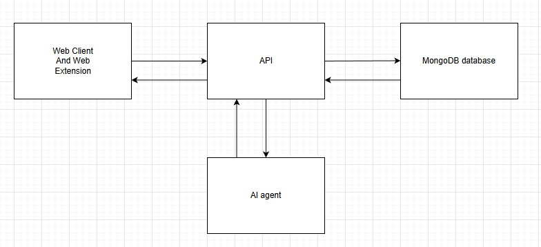
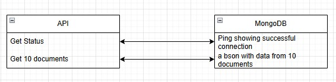
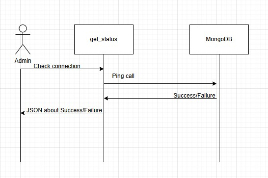

# Session 10 assignment
## Step 1

At the front, the user can interface our application from either the web app or the extension. These ends communicate with our API which determines what to do with that data.
From there documents can be exchanged between the mongoDB database, or inputs and outputs can be exchanged between the AI and the application.

## Step 2

A specific capability is the API calls shown as an example here. The API will send a command for the db to ping back to the server to establish that a connection is there, or can ask for some documents that exist within a given db.

## Step 3

The general flow here, an admin or developer will want to check the connection between the application and its database. API/get_status will ping the DB and based on the information that is given back, either an error or anything. The get_status will package that information up in a way that the developer/admin can use and see.