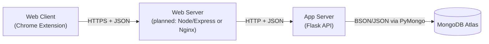

# Elder Fraud Protection Architecture

This document describes the overall architecture of the Elder Fraud Protection Application. 

## High Level Component Diagram

The Web Client is currently accessed through our Elder Fraud Protection Chrome Extension. We are also thinking of having an additional option of an Elder Fraud Protection website or desktop application. The Chrome Extension calls the Web Server, which we haven't implemented yet but likely will be Node/Express or Nginx. The Web Server then calls the App Server (Flask). The App Server then accesses our database MongoDB Atlas. 

## Relationship Diagram

## Flow Diagram

