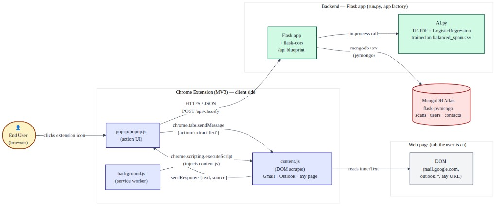
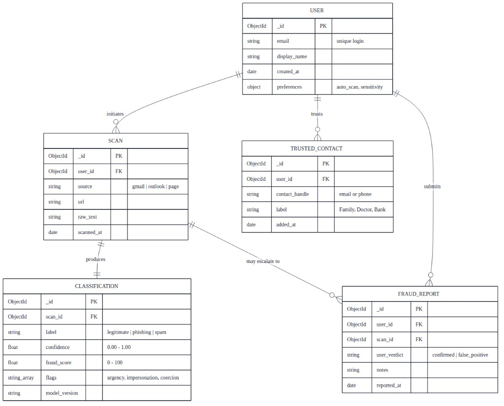
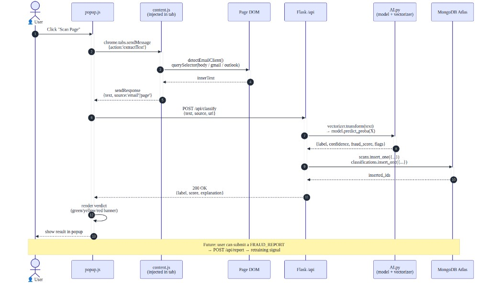

# Elder Fraud Protection Architecture

This document describes the high-level architecture of **Elder Fraud Protection**: a Chrome extension (Manifest V3) that extracts text from web pages and email views, sends it to a Flask backend for machine-learning classification, and persists scan metadata in MongoDB Atlas.

---

## Step 1 — High-level component diagram

The **Chrome extension** runs entirely in the user’s browser. The **popup** (`popup.js`) is the action UI: it coordinates scanning and talks to the backend over HTTPS/JSON. The **service worker** (`background.js`) can inject scripts into the active tab. The **content script** (`content.js`) scrapes the **page DOM**—for example Gmail, Outlook, or a generic page—by reading `innerText` from the relevant regions. On the server, the **Flask** application exposes REST endpoints under an `/api` blueprint and uses **flask-cors** so the extension can call it from the browser. **AI.py** holds the ML pipeline: TF–IDF vectorization and a **LogisticRegression** model trained on labeled data (for example `balanced_spam.csv`), invoked in-process when a classify request arrives. **MongoDB Atlas** stores application data (for example scans, users, and contacts) via **PyMongo** / **Flask-PyMongo**, using a `mongodb+srv` connection string. Together, these components form a closed loop: the extension supplies text, Flask classifies it with AI.py, results and metadata are written to the database, and the extension can show risk and explanations to the user.

---

## Step 2 — Entity diagram (document model)

The data model is document-oriented and centers on **`USER`**. Each user may initiate many **`SCAN`** records; each scan captures where the text came from (`source` such as gmail, outlook, or page), optional **`url`**, **`raw_text`**, and **`scanned_at`**. A scan produces exactly one **`CLASSIFICATION`**, which stores the model output: **`label`** (for example legitimate, phishing, spam), **`confidence`**, **`fraud_score`**, **`flags`** (such as urgency or impersonation), and **`model_version`**. Users maintain a list of **`TRUSTED_CONTACT`** documents (handle, label, timestamps) so the product can personalize or suppress noise. Optionally, a user may file a **`FRAUD_REPORT`** tied to a scan, recording **`user_verdict`** (for example confirmed fraud vs. false positive), **`notes`**, and **`reported_at`**—useful for feedback and future model improvement. Relationships are implemented with **`ObjectId`** references (`user_id`, `scan_id`) between collections rather than SQL joins.

---

## Step 3 — Sequence diagram — “Scan page” feature

When the user clicks **Scan Page** in the extension popup, **`popup.js`** sends a message to the content script with `chrome.tabs.sendMessage({ action: 'extractText' })`. **`content.js`** runs in the tab: it detects the email client if applicable and queries the DOM (for example `body` or provider-specific selectors), then returns **`innerText`** to the popup via **`sendResponse({ text, source: 'email' | 'page' })`**. The popup **`POST`s** to **`/api/classify`** with **`{ text, source, url }`**. The Flask layer forwards the text to **`AI.py`**, which runs **`vectorizer.transform`** and **`model.predict_proba`** to obtain **`label`**, **`confidence`**, **`fraud_score`**, and **`flags`**. Flask persists a **`scan`** document and a **`classification`** document in **MongoDB Atlas** and receives **`inserted_ids`**. The API responds with **`200 OK`** and a JSON payload the popup uses to **render a verdict** (for example green / yellow / red). A planned follow-on is **`POST /api/report`** for **`FRAUD_REPORT`** submissions to support retraining signals.
